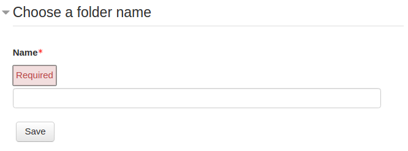
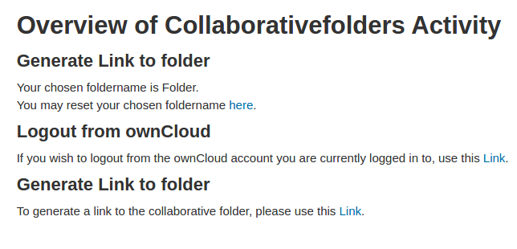

# Moodle Activity Module `collaborativefolders`

# English

This Activity Module allows teachers to create folders in [ownCloud](https://owncloud.org/), 
which can be allocated to groups of students who can then voluntarily subscribe work collaboratively in these folders.

Written by project seminar sciebo@Leanrweb of the University of Münster.

## Information

This module is depending on the [`oauth2owncloud` plugin](https://github.com/pssl16/moodle-tool_oauth2owncloud) and
can not be used separately.

## Installation

Please place this plugin under `mod/collaborativefolders` in your Moodle directory.
Before being able to use the plugin, a technical user account has to be authenticated in ownCloud. The regarding settings can be found under 
`Site administration ► Plugins ► Activity modules ► collaborativefolders`. 
While using the plugin the technical user should not be changed, because it could result in synchronization problems.
Activities that were generated beforehand could become unusable.

## Teacher View

Firstly, the teacher has to add a `collaborativefolders` instance to a course. 
Upon creation the teacher chooses a name for the instance, which is displayed in
the course context. Furthermore, the teacher can decide whether he has access to the collaborative folder(s).
At last, the teacher can choose, whether or not he wants to activate the groupmode for the
concerning instance. Activation of the groupmode leads to the creation of separate group folders in ownCloud.

## User View

After the folder(s) was created by a cron task, users are requested to choose an individual name for the folder.

 
 
Afterwards, users can change the name and logout from their ownCloud account. 
If a user entered a valid name for the folder and already is authenticated in ownCloud,
he is able to generate a Share for the collaborative folder. Thereafter, the folder is accessible either from
the activity instance or from the personal ownCloud directory.
 
 

Further information can be found in our [documentation](https://pssl16.github.io).

# Deutsch

Dieses Aktivitätsmodul ermöglicht Lehrenden eines Kurses Ordner in [ownCloud](https://owncloud.org/) zu erstellen, welche Gruppen von Sudierenden
zugeornet werden können, die anschließend freiwillig kollaborativ darin arbeiten können.

Erstellt von dem Projektseminar Sciebo@Leanrweb der Universität Münster.

## Information

Diese Modul ist abhängig von dem [oauth2owncloud Plugin](https://github.com/pssl16/moodle-tool_oauth2owncloud) und
kann nicht separat genutzt werden.

## Installation

Plazieren Sie das Plugin bitte in den Ordner `mod/collaborativefolders` Ihres Moodle Verzeichnisses.
Bevor das Plugin genutzt werden kann, muss ein technischer Nutzer Account in ownCloud authentifiziert werden. Die betreffenden Einstellungen
können unter `Site administration ► Plugins ► Activity modules ► collaborativefolders` vorgefunden werden.
Im laufenden Betrieb dieses Plugins sollte der technischer Nutzer nicht gewechselt werden, da dies zu Synchronisierungsproblemen führen könnte.
Aktivitäten, welche zuvor erstellt worden sind, könnten unbrauchbar werden.

## Sicht des Lehrenden

Zunächst muss der Lehrende eine Instanz der `collaborativefolders` Aktivität zum Kurs hinzufügen.
Beim Erstellen wählt der Lehrende einen Namen für die Instanz aus, welcher im Kurs angezeigt wird.
Darüber hinaus kann der Lehrende entscheiden ob er selbst Zugriff zu dem/den Ordner/-n haben soll.
Zuletzt kann der Lehrende auch wählen, ob er den Gruppenmodus für die betreffende Instanz aktivieren möchte.
Eine Aktivierung des Gruppenmodus bewirkt die Erstellung einzelner Gruppenordner in ownCloud.

## Sicht der Studierenden

Nachdem der/die Ordner von einem Cron Task erstellt worden sind, werden die Nutzer dazu aufgefordert, 
einen individuellen Namen für den Ordner anzugeben.

 
 
Der Name kann anschließend wieder von den Nutzern geändert werden und bei Bedarf können diese sich in ownCloud ausloggen.
Hat ein Nutzer einen validen Namen für den Ordner eingegeben und ist bereits in ownCloud authentifiziert,
so hat er die Möglichkeit den kollaborativen Ordner für sich freizugeben. Danach kann auf den Ordner entweder
über die Instanz der Aktivität oder das persönliche ownCloud Verzeichnis zugegriffen werden.
 
 

Nähere Informationen zu dem Plugin finden Sie in unserer [Dokumentation](https://pssl16.github.io).